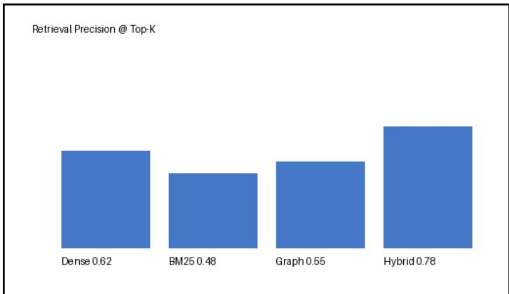

## QueryNest Multimodal RAG - Sample Document

QueryNest is a multimodal document intelligence system. It ingests complex documents such as PDF, images, tables and equations, then enables hybrid retrieval and citation-based answering. The core pipeline is: parse, index, hybrid retrieval, rerank, context construction, and final answer generation.

Hybrid retrieval in QueryNest combines Dense vector retrieval, BM25 keyword retrieval, and LightRAG knowledge-graph retrieval. All candidate hits are fused with Reciprocal Rank Fusion (RRF), deduplicated, and finally reranked before the context window is assembled.

<table><tr><td>Method</td><td>Precision</td><td>Recall</td></tr><tr><td>Dense only</td><td>0.62</td><td>0.55</td></tr><tr><td>BM25 only</td><td>0.48</td><td>0.40</td></tr><tr><td>Hybrid (RRF)</td><td>0.78</td><td>0.71</td></tr></table>

